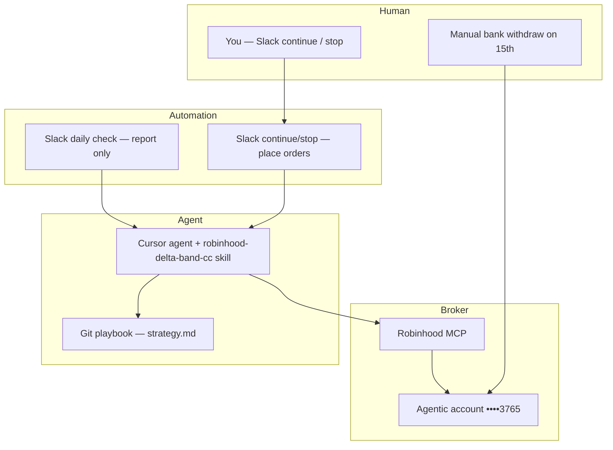
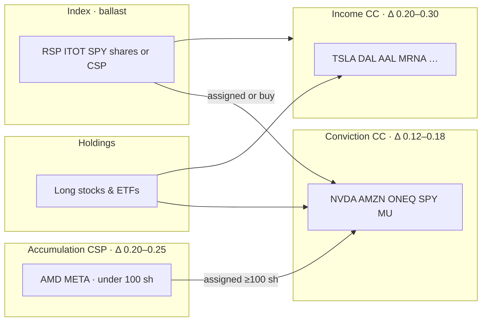
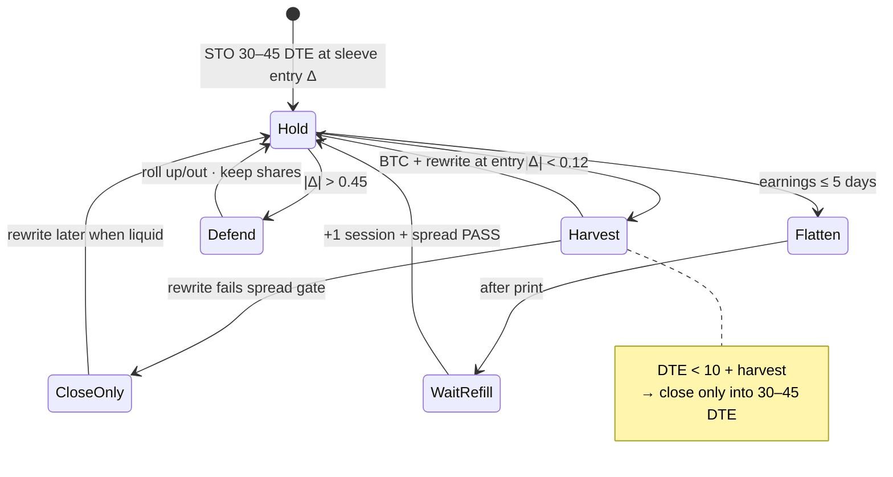
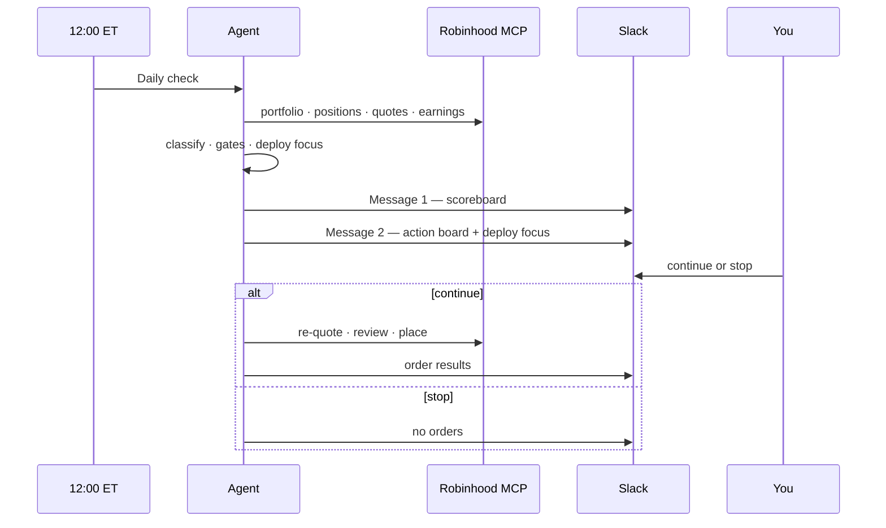
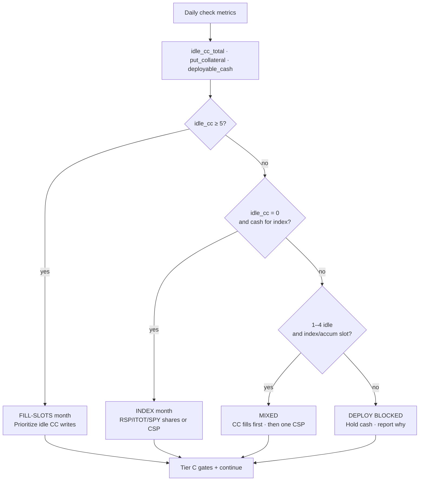
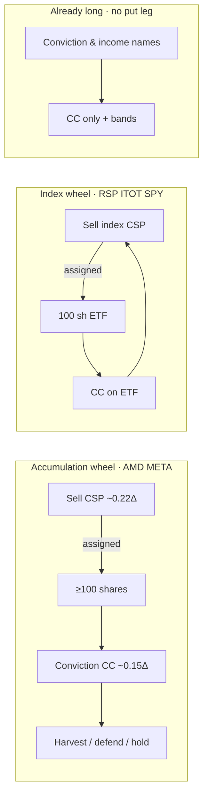
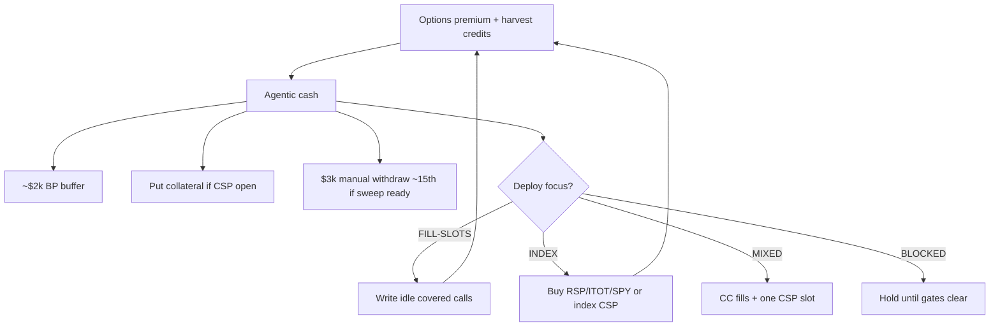
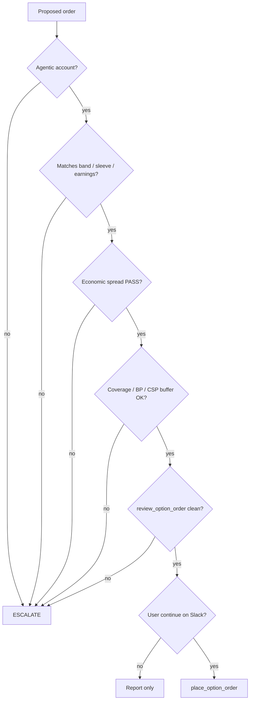

# Strategy canvas — visual map

Visual companion to [strategy.md](strategy.md). Open in Cursor, GitHub, or any Mermaid renderer.

---

## 1. System stack (who does what)



---

## 2. Portfolio sleeves (what you own vs what you sell)



| Sleeve | Option | Goal |
|--------|--------|------|
| Conviction | Short **call** | Keep shares · low assignment risk |
| Income | Short **call** | Max premium · assignment OK |
| Accumulation | Short **put** | Buy shares cheaper · wheel into conviction |
| Index | **Put** or **shares** | Diversify · grow CC book |

---

## 3. Delta bands (every open short)



**ATM ≈ Δ 0.50** · **Δ → 1 = deep ITM** (not “at strike”).

| Zone | |Δ| | Action |
|------|-----|--------|
| Harvest | < 0.12 | Buy to close · rewrite |
| Hold | 0.12 – 0.45 | Collect theta |
| Defend | > 0.45 | Roll to keep shares |

---

## 4. Daily cycle (automation)



---

## 5. Deployment focus (where new premium goes)



**Priority when scaling income:** fill idle CCs → then index/accumulation with spare cash.

---

## 6. Wheel loops (CSP → shares → CC)



Use the **wheel** to **enter or grow** positions · use **CC + bands** on names you already hold full size.

---

## 7. Cash flow (premium → deploy)



---

## 8. Tier C gates (auto-place checklist)



Spread PASS if **any**: ≤20% of mid · ≤$0.15 abs · adverse fill ≤10% roll credit or **≤$0.25** close-only.

---

## 9. Income scale (full book targets)

```mermaid
block-beta
  columns 4
  block:Idle["Today · ~29 idle CC slots"]:1
  block:Partial["Partial book · ~$3–5k/mo net"]:1
  block:Full["Full book · ~49 CC slots"]:1
  block:Net["Target net · ~$7–8k/mo typical"]:1
```

| Stage | Gross STO / mo | Net after harvest & defend |
|-------|----------------|----------------------------|
| Partial deployment | ~$4k open | ~$3–5k |
| Full book | ~$8.7–9.1k | ~$7–8k typical · ≥$6k floor |

---

## 10. One-page ASCII summary

```
┌─────────────────────────────────────────────────────────────┐
│  LONG STOCK (conviction + income + index)                   │
│    └─ short CALLS ── Δ bands: harvest | hold | defend       │
│    └─ idle CC? ── FILL-SLOTS month                          │
├─────────────────────────────────────────────────────────────┤
│  CASH ── CSP (accum AMD/META · index RSP/ITOT/SPY)          │
│    └─ assigned ── more shares ── more CC capacity           │
│    └─ book full? ── INDEX month                             │
├─────────────────────────────────────────────────────────────┤
│  DAILY: snapshot → classify → gates → Slack → continue?     │
└─────────────────────────────────────────────────────────────┘
```

---

## Related docs

- [strategy.md](strategy.md) — full rules
- [slack-automations.md](slack-automations.md) — Slack prompts
- [income-sweep.md](income-sweep.md) — savings withdraw policy
- [.cursor/skills/robinhood-delta-band-cc/SKILL.md](../.cursor/skills/robinhood-delta-band-cc/SKILL.md) — agent procedure
